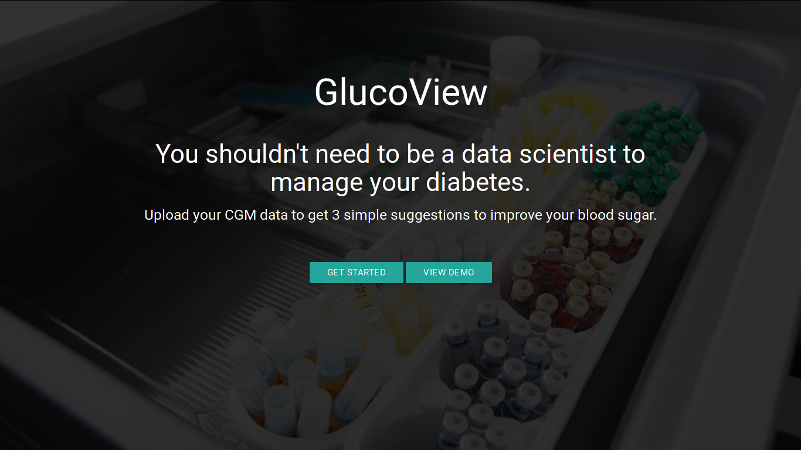

# GlucoView

## Inspiration

In the past 5 years, people with type one diabetes have gone from having blood glucose measurements 4 times a day to hundreds of times a day, thanks to continuous glucose monitors. Despite the more than 100-fold increase in the amount of data that we have, the ways that we view that data have hardly changed. What's more, when patients want to use the vast amounts of data available to them to make decisions about their diabetes care regimen, they need to discuss it with a doctor - a process which can take months for some patients, if it is available at all.

## What it does

GlucoView vastly simplifies the process of interpreting CGM data by providing a small set of actionable items that the use can implement, ranging from changing insuling pump settings to setting reminders to take insulin.

## How we built it

GlucoView imports it's data from tidepool blip, allowing anyone with a tidepool account to enjoy a simpler way to interact with their diabetes data.

In a few clicks, the use can import data from tidepool and have personalized suggestions ready to help them get their diabetes under control.
